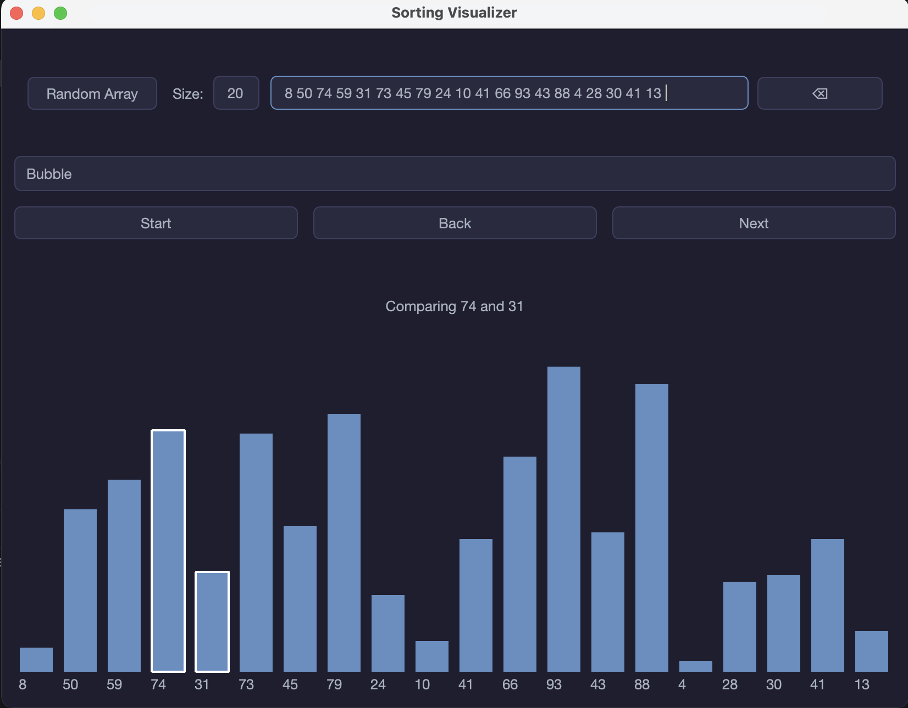
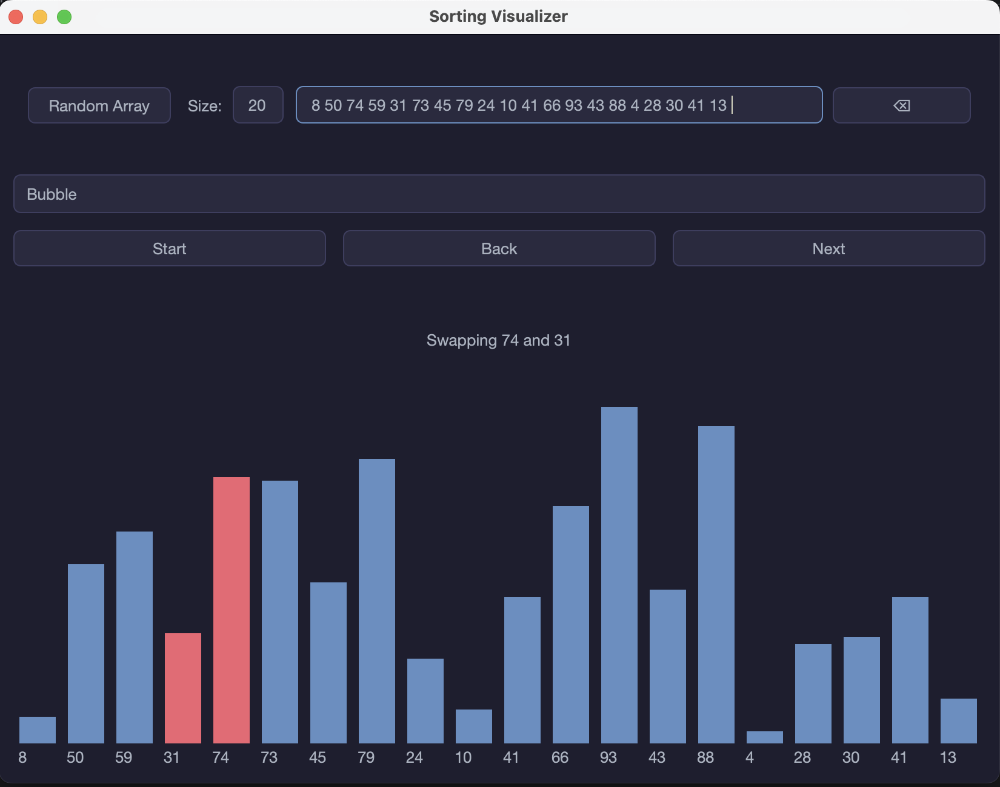
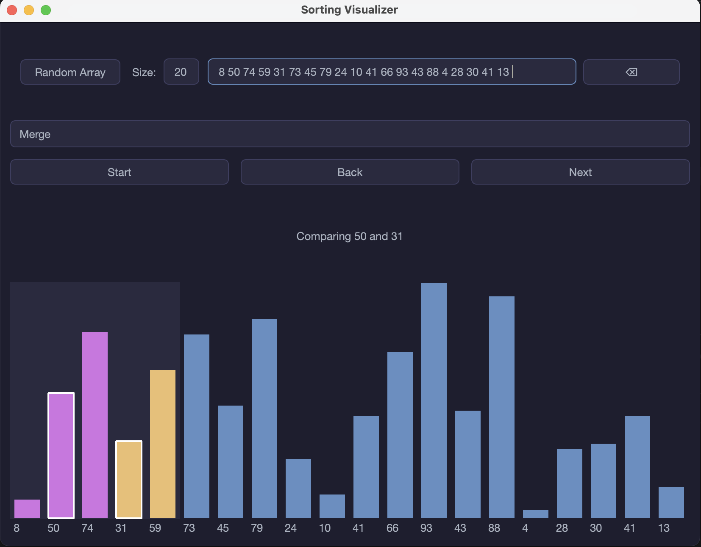
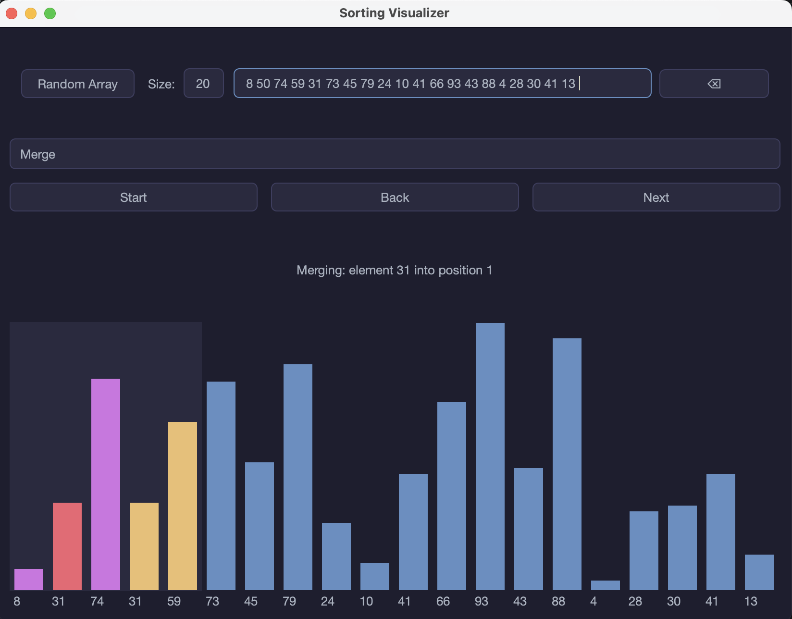
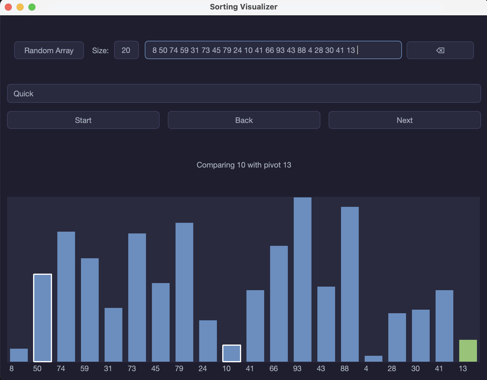
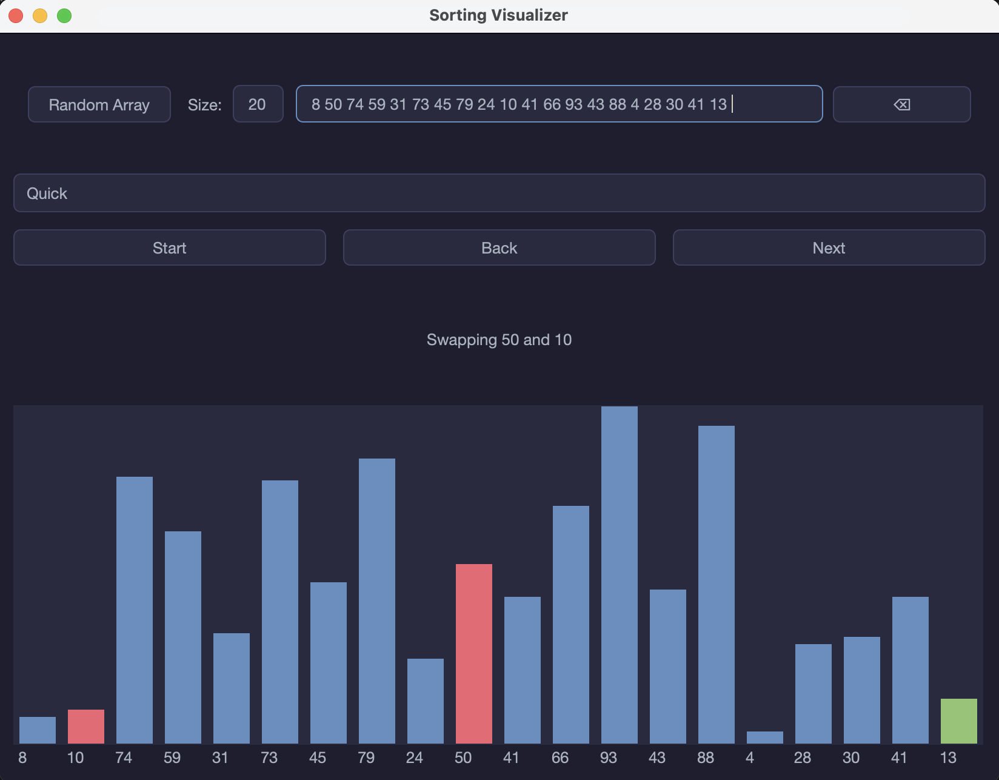
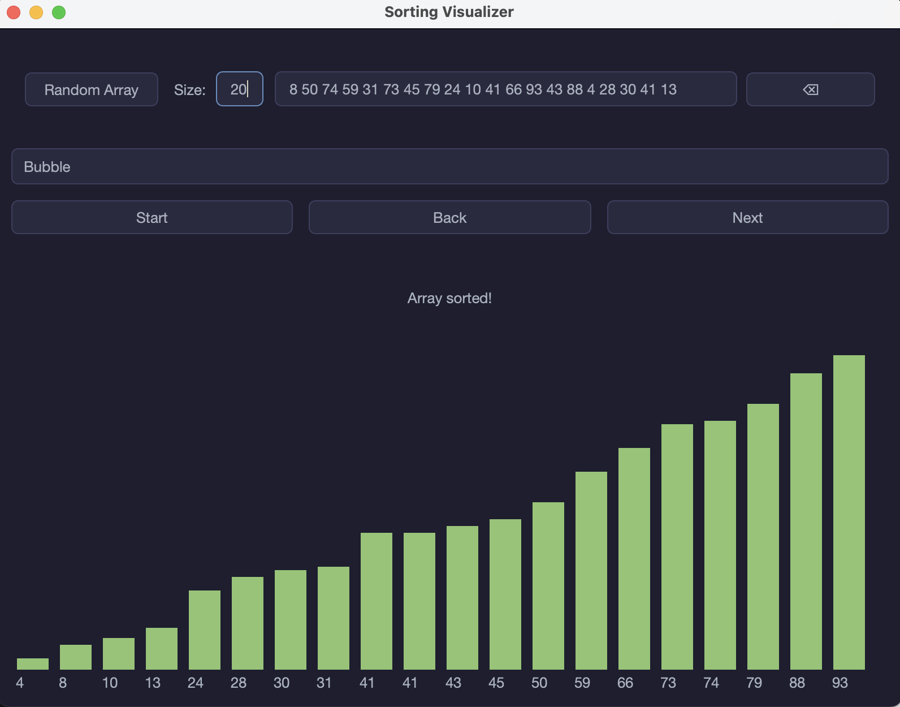

# Sorting Visualizer

Десктопное приложение на C++ и Qt5 для пошаговой визуализации алгоритмов сортировки. Показывает, как сортировка преобразует массив на каждом шаге: какие элементы сравниваются, где происходит обмен, как делится и собирается массив при слиянии, как выбирается опорный элемент в быстрой сортировке.

## Содержание

- [Возможности](#возможности)
- [Как это выглядит](#как-это-выглядит)
- [Сборка проекта](#сборка-проекта)
- [Запуск](#запуск)
- [Использование](#использование)
- [Тесты](#тесты)
- [Документация кода](#документация-кода)
- [Структура проекта](#структура-проекта)

## Возможности

- Три алгоритма сортировки: пузырьковая (Bubble), сортировка слиянием (Merge), быстрая сортировка (Quick).
- Пошаговая визуализация: каждое сравнение, обмен, разбиение и слияние — отдельный шаг с текстовым описанием.
- Управление воспроизведением: автоматическое проигрывание шагов по таймеру, пауза, переход на шаг вперёд и назад.
- Ввод массива вручную (числа через пробел) или генерация случайного массива заданного размера (от 1 до 50 элементов).
- Цветовая индикация происходящего на каждом шаге: сравниваемые элементы, обмен, разделённые половины при слиянии, опорный элемент, готовый отсортированный массив.

## Как это выглядит

## Визуализация алгоритмов сортировки

### Пузырьковая сортировка (Bubble Sort)

На каждом шаге выделяется сравниваемая пара элементов:



А затем — пара, меняемая местами:



---

### Сортировка слиянием (Merge Sort)

Массив делится на две половины (фиолетовая и янтарная), внутри которых происходит сравнение элементов перед слиянием:



Процесс слияния двух отсортированных половин в результирующий массив:



---

### Быстрая сортировка (Quick Sort)

На каждом шаге выделяется текущий опорный элемент (зелёный), и выполняется сравнение с ним:



Если второй выделенный элемент больше опорного, он обменивается местами с первым выделенным:



---

### Завершение сортировки

После завершения работы любого алгоритма итоговый отсортированный массив подсвечивается зелёным:


### Цветовая легенда визуализатора

| Цвет | Значение |
|---|---|
| Синий | обычный элемент |
| Фиолетовый | левая половина массива при разбиении/слиянии |
| Янтарный | правая половина массива при разбиении/слиянии |
| Зелёный | опорный элемент (pivot) или полностью отсортированный массив |
| Красный | элементы, участвующие в обмене или копировании |
| Белая рамка | элементы, которые сравниваются на текущем шаге |

## Сборка проекта

### Зависимости

- Компилятор с поддержкой C++17.
- CMake версии 3.10 или новее.
- Qt5 (модули Widgets и Core).
- Doctest подключается автоматически через `FetchContent` при первой сборке тестов — устанавливать отдельно не нужно, но потребуется доступ в интернет на этапе конфигурации CMake.

На macOS Qt5 можно установить через Homebrew:

```bash
brew install qt@5 cmake
```

### Сборка

```bash
git clone https://github.com/adeliasavitskaya/sorting-visualizer.git
cd sorting-visualizer
mkdir build && cd build
cmake .. -DCMAKE_PREFIX_PATH=$(brew --prefix qt@5)
cmake --build .
```

Флаг `-DCMAKE_PREFIX_PATH` нужен, если Qt5 установлен через Homebrew и не находится автоматически. Если Qt5 уже виден CMake (например, установлен через официальный онлайн-инсталлятор с настроенными переменными окружения), флаг можно не указывать.

В результате сборки появятся два исполняемых файла: `sorting-visualizer` (само приложение) и `tests` (тестовый набор).

## Запуск

Из каталога сборки:

```bash
./sorting-visualizer
```

## Использование

1. Введите массив чисел через пробел в текстовое поле либо нажмите **Random Array**, чтобы сгенерировать случайный массив. Размер случайного массива задаётся полем **Size** (от 1 до 50 элементов).
2. Выберите алгоритм сортировки в выпадающем списке: Bubble, Merge или Quick.
3. Нажмите **Start** — шаги начнут автоматически проигрываться с интервалом в одну секунду. Повторное нажатие ставит воспроизведение на паузу.
4. Кнопки **Back** и **Next** позволяют перемещаться по шагам вручную, в любой момент, включая паузу.
5. Под кнопками отображается текстовое описание текущего шага (например, «Comparing 74 and 31» или «Splitting array into two halves»), а сама визуализация показана столбиками внизу окна.
6. Кнопка со значком ⌫ очищает поле ввода и сбрасывает текущую визуализацию.

Смена алгоритма или изменение массива во время паузы или после завершения сортировки автоматически пересчитывает шаги для нового состояния.

## Тесты

Тесты написаны с использованием [doctest](https://github.com/doctest/doctest) и покрывают все три алгоритма сортировки, а также единую точку входа `generate_steps`. Для каждого алгоритма проверяются как корректность результата (отсортированный массив, граничные случаи — пустой массив, один элемент, дубликаты, уже отсортированный и обратно отсортированный массив), так и состав сгенерированных шагов (наличие нужных типов шагов, корректное завершение).

Запуск тестов из каталога сборки:

```bash
ctest
```

Либо напрямую через исполняемый файл, с более подробным выводом:

```bash
./tests
```

## Документация кода

Документация в формате Doxygen сгенерирована в каталог `docs/`. Чтобы собрать её заново после изменений в коде:

```bash
doxygen Doxyfile
```

Команда запускается из корня репозитория. Результат — HTML-документация в `docs/html/`, откуда можно открыть `index.html` в браузере.

## Структура проекта

```
sorting-visualizer/
├── src/
│   ├── algorithms/        # реализации сортировок (bubble, merge, quick)
│   ├── core/               # структура шага сортировки и генератор шагов
│   ├── ui/                 # окно приложения, ввод массива, визуализатор
│   └── main.cpp
├── tests/                  # тесты на doctest для алгоритмов и генератора шагов
├── docs/                    # сгенерированная Doxygen-документация
├── images/                  # скриншоты для README
├── CMakeLists.txt
├── Doxyfile
└── .clang-format
```